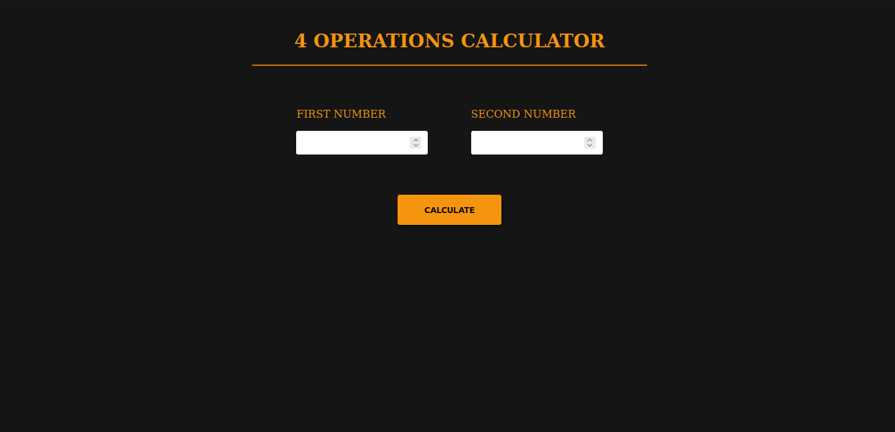
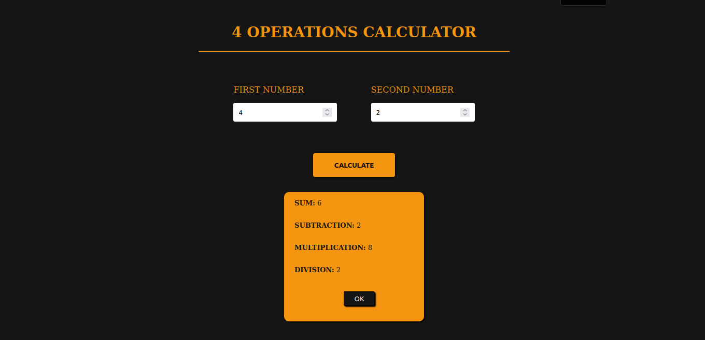

# Challenge 2: 4 operations calculator

This is the second challenge of the "Javascript I - Programming Logic" module of the "Full Stack Javascript by OneBitCode" course.

## Technologies

## Description

The program receives two numerical values ​​informed by the user and then calculates the result of the four basic mathematical operations:

- addition
- subtraction
- multiplication
- division.

After calculating the results, the program will display them on the screen.

## Program in the browser

## Contacts

 
     
  

